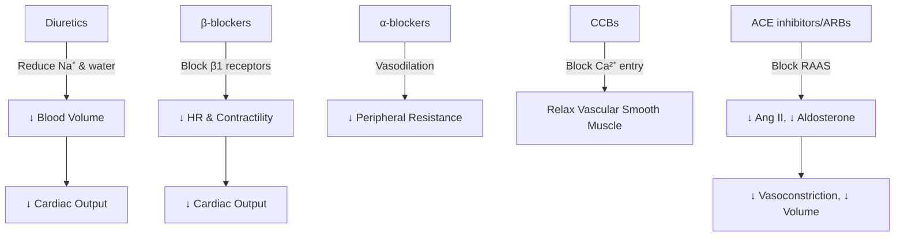
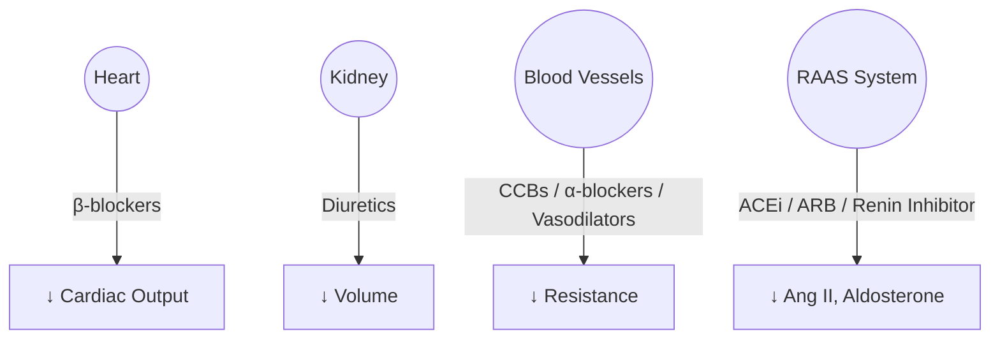

# Hypertension & Anti-Hypertensive Drugs 🩺

---

## What is Hypertension?

- Hypertension = **persistently elevated blood pressure** above normal values.  
- Normal BP: `<120 / <80 mmHg`  
- Hypertension: `≥140 / ≥90 mmHg` (sustained).  

**Complications**: Stroke, MI, Heart failure, Chronic kidney disease, Retinopathy.

---

## Goals of Therapy 🎯
- Reduce blood pressure to safe levels.  
- Prevent target organ damage (heart, kidney, brain, eyes).  
- Improve survival & quality of life.

---

## Classification of Anti-Hypertensive Drugs 💊

| Class | Subtypes | Examples |
|-------|----------|----------|
| **Diuretics** | Thiazides | Hydrochlorothiazide, Chlorthalidone |
| | Loop | Furosemide |
| | K⁺-sparing | Spironolactone, Amiloride |
| **Sympatholytics** | β-blockers | Atenolol, Metoprolol, Propranolol |
| | α-blockers | Prazosin |
| | Central α2 agonists | Clonidine, Methyldopa |
| **Vasodilators** | Direct | Hydralazine, Minoxidil |
| | Calcium channel blockers | Amlodipine, Verapamil, Diltiazem |
| **RAAS Inhibitors** | ACE inhibitors | Enalapril, Ramipril |
| | ARBs | Losartan, Valsartan |
| | Direct renin inhibitor | Aliskiren |

---

## Mechanisms of Action ⚙️

---

## Hypertension Drug Targets Diagram 🗺️

